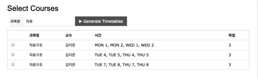

# 시간표 생성 시스템 'Timetable'
원하는 과목을 선택하면 가능한 시간표를 생성해주는 웹 서비스입니다.

## Getting Started
### Prerequisites
- 실행을 위해서는 java(1.8 이상)이 설치되어 있어야 합니다.

### Running
1. gradle wrapper를 이용하여 build
```
$ ./gradlew build
```

2. Spring Boot Application으로 실행

3. http://localhost:8080/ 접속하여 아래 화면 확인



## Built With
* [Spring Boot](https://spring.io/projects/spring-boot) - 백엔드 프레임워크
* [H2DB](http://www.h2database.com/html/main.html) - 메모리DB
* [Vue.js](https://kr.vuejs.org/) - 프론트엔드 프레임워크
* [Git](https://git-scm.com/) - 형상관리
